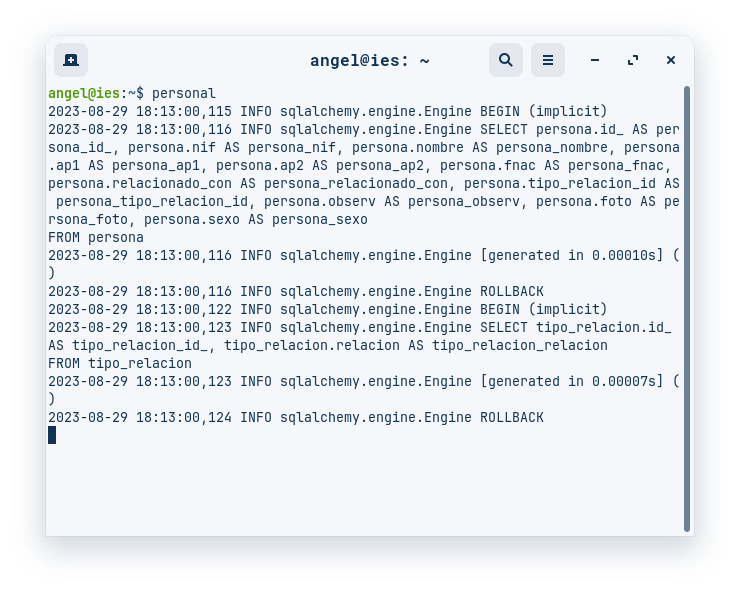
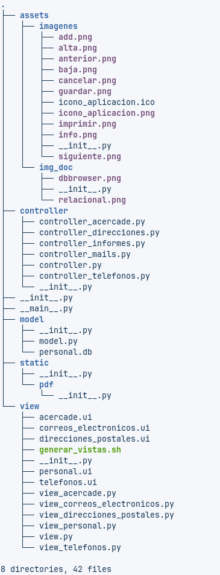
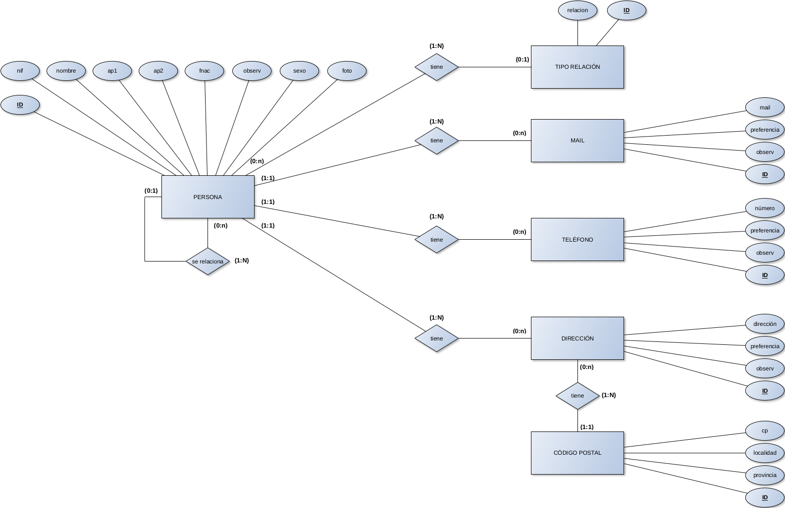
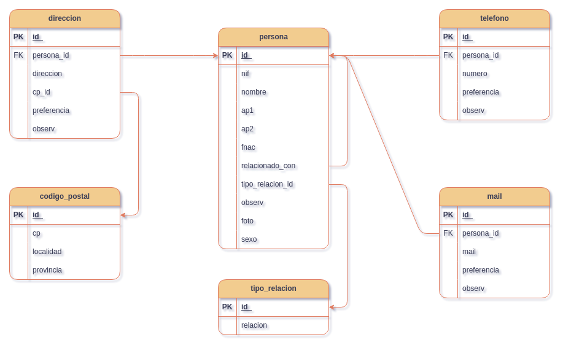
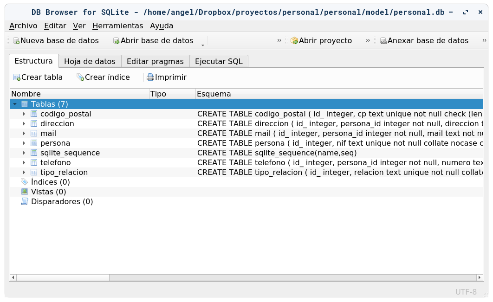
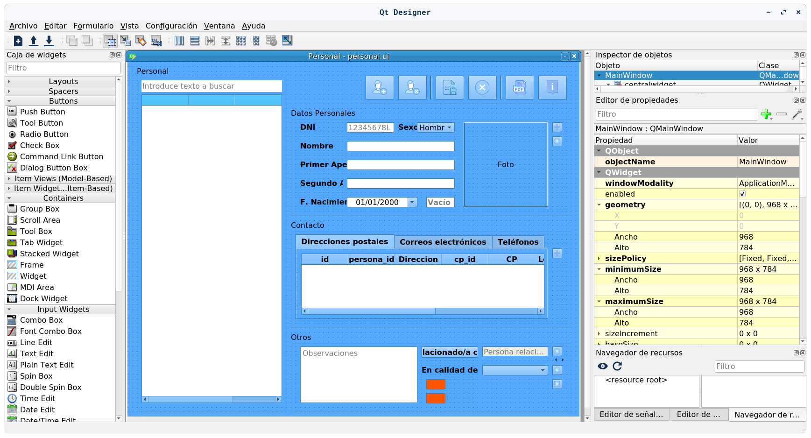
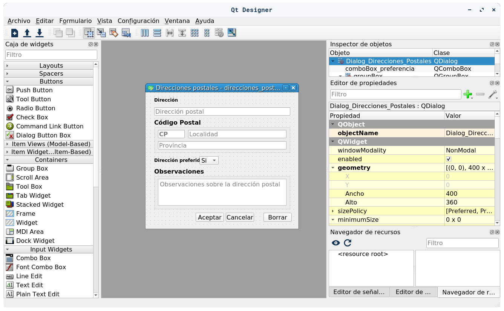
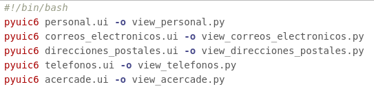

# personal
Aplicación para la gestión de datos personales de personas. 

Se gestionan datos de personas, incluyendo nombre, fecha de nacimiento, sexo, etc, e incluso su foto (en formato PNG). Además para cada persona se pueden registrar varias direcciones postales, teléfonos y correos electrónicos. 

El aplicativo dispone de un sistema de filtrado de personas, por nombre y apellidos, para una búsqueda efectiva.

El sistema permite relacionar unas personas con otras. 

También se implementa un sistema de impresión, para imprimir la ficha de una persona dada.  

# Instalación

Antes de instalar el programa asegurarse que se tiene actualizado <strong>pip</strong>, mediante:

    pip install --upgrade pip

El programa se instala mediante pip:

    pip install personal-1.0.0.tar.gz

Si hubiera algún problema con <strong>xcb</strong>, se deberá instalar la librería correspondiente. Para sistemas Debian se deberá ejecutar:

    sudo apt-get install -y libxcb-cursor-dev 

# Ejecución

Desde el Terminal escribir <strong>personal</strong>

Se muestra el aplicativo:

# Diseño de la aplicación

El diseño de la aplicación se basa en el paradigma <strong>Modelo Vista Controlador</strong>. La estructura de ficheros es la siguiente:

 
El punto de entrada de la aplicación es el fichero <strong>__ main__.py</strong>.

Está escrita 100% en Python 3. Los módulos externos que utiliza son:

  - SQLAlchemy
  - ReportLab
  - Pillow
  - PyQt6
  
# Diseño Entidad - Relación de la base de datos

El MER de la base de datos es el siguiente:

# Modelo relacional de la base de datos

El modelo relacional de la base de datos es el siguiente:

# Implementación de la base de datos

La base de datos está implementada en SQLite. 

  * Se utiliza el <strong>ORM SQLAlchemy</strong> para trabajar con la base de datos, mapeando tablas y relaciones.

  * El programa permite gestionar fotos de personas (imágenes), que se guardan en la tabla "persona" de la base de datos, como tipo de dato <strong>BLOB</strong>.

# Diseño de la interfaz gráfica

La parte del frontend está implementada en PyQt6. Se ha utilizado la herramienta <strong>Qt Designer</strong> para el diseño de las ventanas.

Diseño de la ventana principal:

Diseño de la ventana de gestión de direcciones postales:

   * Qt Designer genera ficheros con extensión <strong>ui</strong>. Estos ficheros se compilan con la herramienta __pyuic6__, generando los ficheros Python correspondientes. Para hacerlo de forma automática se ha creado un shell script llamado <strong>generar_vistas.sh</strong>, que se encuentra en junto con estos ficheros. Su contenido es el siguiente:

# Licencia

      personal, un sistema de gestión de personas

        Copyright (C) 2023 Ángel Luis García García

        This program is free software: you can redistribute it and/or modify
        it under the terms of the GNU General Public License as published by
        the Free Software Foundation, either version 3 of the License, or
        (at your option) any later version.

        This program is distributed in the hope that it will be useful,
        but WITHOUT ANY WARRANTY; without even the implied warranty of
        MERCHANTABILITY or FITNESS FOR A PARTICULAR PURPOSE.  See the
        GNU General Public License for more details.

        You should have received a copy of the GNU General Public License
        along with this program.  If not, see <http://www.gnu.org/licenses/>.

 

